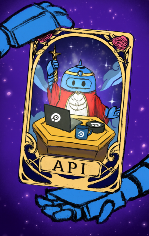

# Open API схемы для Topvisor API

Спецификация Open API упрощает взаимодействие между ПО и упрощает работу разработчиков этих ПО.

В проекте представлены схемы с описанием API "всех" (на данный момент не все сервисы описаны в схемах) сервисов Топвизор.

## API клиент

Для работы с API Топвизор в окружении JavaScript используется библиотеку `@topvisor/ui/api`.
Подробнее на сайте: https://ui.topvisor.com/?path=/docs/api--docs

<table>
  <tr>
    <td style="vertical-align: middle;">
      
    </td>
    <td style="vertical-align: middle;">
      Используя API клиент в своей IDE вы будете иметь подсказки, документацию и проверку типов сразу по всему API. Как по волшебству 🪄.
    </td>
  </tr>
</table>

## JSON

Схемы представлены в JSON формате: [./src/json/](./src/json).

Описание методов API: [./src/json/Topvisor.json](./src/json/Topvisor.json).  
Схемы всех моделей данных: [./src/json/Models.json](./src/json/Models.json).

Для быстрого теста можно использовать публичный демо: https://petstore.swagger.io/  
Введите URL для просмотра методов: https://raw.githubusercontent.com/topvisor/topvisor-openapi/main/src/json/Topvisor.json  
Введите URL для просмотра моделей данных: https://raw.githubusercontent.com/topvisor/topvisor-openapi/main/src/json/Models.json

## YAML

Все схемы представлены в YAML в одном файле: [./src/yaml/TopvisorSingleFile.yaml](./src/yaml/TopvisorSingleFile.yaml).

Ссылка для импорта в сторонние сервисы: https://raw.githubusercontent.com/topvisor/topvisor-openapi/main/src/yaml/TopvisorSingleFile.yaml

## Typescript

Схемы представлены в typescript формате: [./src/ts/](./src/ts).

## NPM

Проект не имеет релизов, обновляется по мере изменений API.

Установка: `npm install github:topvisor/topvisor-openapi`

Обновление: `npm update topvisor-openapi`

### Typescript

После установки при написании кода TypeScript вы сможете использовать автоподсказки, описывающие API методы, их параметры и результаты.

```typescript
import type { paths } from 'topvisor-openapi/src/ts/Topvisor.ts';

type ExtractServicesNamesFromPaths<T> = T extends `/${string}/${infer P}/${string}` ? P : never

/**
 * Имя сервиса
 */
type ServicesNames = ExtractServicesNamesFromPaths<Path>;

/**
 * Путь к вызову метрода
 */
type Path = keyof paths;

const methodPath: Path = '/get/payments_2/'; // <-- В ходе написания кода вы будете получать подсказки
const serviceName: ServicesNames = 'example_2';
```

## Полезные ссылки

### Топвизор

Документация Топвизор API: https://topvisor.com/ru/api/v2/  
Документация по инструментам Топвизор: https://topvisor.com/ru/support/  
Online-поддержка пользователей Топвизор: https://topvisor.com/#view-win_tickets=messages:0

### Open API

Введение в Open API: https://habr.com/ru/articles/776538/  
Примеры описания простого проекта на Open API: https://editor.swagger.io/  
Официальная документация Open API: https://learn.openapis.org/
